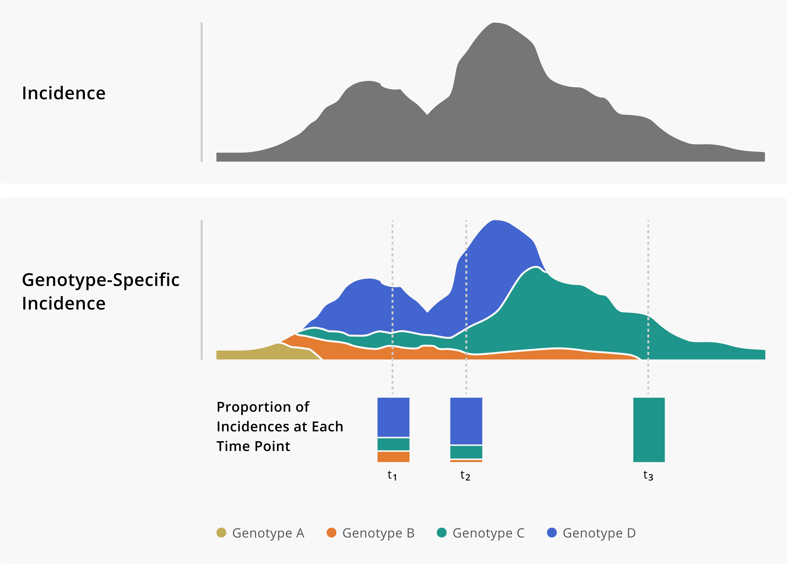
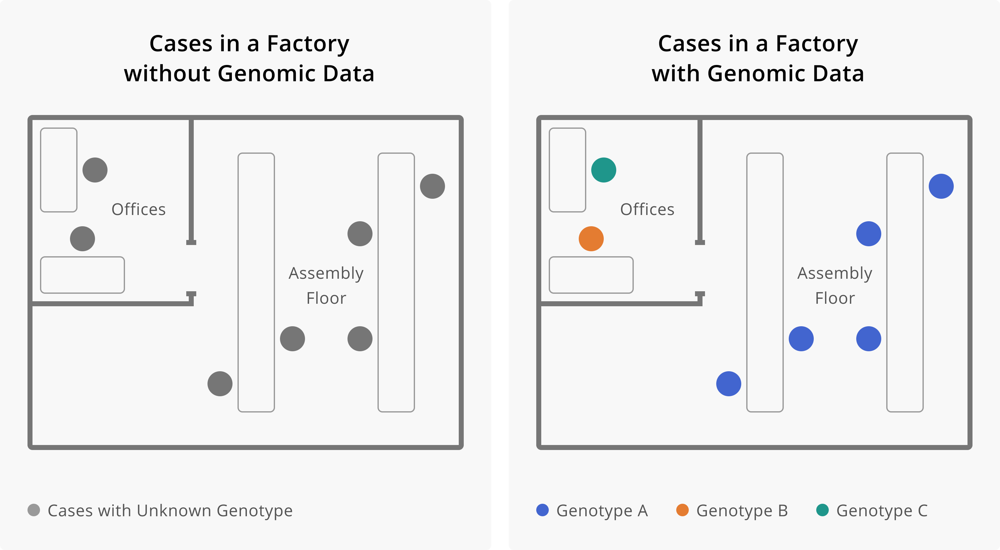

# The value of pathogen genomics in applied epidemiology

_Have you ever wondered “What would be the benefit of having genomic surveillance capacity?” This chapter attempts to answer that question. In the following chapter we describe the utility of pathogen genomic data for public health surveillance and for outbreak response. We have distinguished between surveillance and outbreak response use cases for two reasons. Firstly, the turnaround times for which genomic data retain utility are different for surveillance versus outbreak response. Typically, outbreak response requires sequencing and genomic analysis to occur more rapidly. Secondly, the sampling frames that you would use for surveillance are different from what you would use for outbreak response. We will elaborate on sampling frames in Chapter 4 of this resource. Finally, we recognize that getting a genomic epidemiology program up and running can be slow and challenging. We therefore discuss how genomic data can remain useful even when they are not available in real time. This chapter should be pertinent to most readers, since it provides a broad rationale for why genomic surveillance and genomic epidemiology help support applied epidemiology activities._

## The value of genomic epidemiology for surveillance.

Genomic data provide additional resolution to determine relationships between cases. From a surveillance standpoint, this ability to delineate clusters of related cases more sensitively allows public health practitioners to see separate pathogen lineages circulating within a particular area of interest. This capacity allows the epidemiologist to see distinct chains of transmission even when they circulate in a population concurrently, a finding that can be challenging to see in case surveillance data alone.

What is the benefit of detecting these distinct transmission chains? Firstly, this additional layer of resolution enables the public health practitioner to detect the emergence or introduction of new lineages into their community or surveillance area, and distinguish introduction events from endemic transmission within the surveillance area. Developing a more precise understanding of how the processes of introduction and endemic transmission drive incidence within your area allows public health authorities to intervene in more precise and tailored ways. For example, if most cases within the surveillance area result from multiple introductions of distinct lineages that transmit only minimally within the surveillance area, then policies that seek to reduce the introduction of disease from other areas are likely to be more effective in reducing case counts. In contrast, if most cases are attributable to a single circulating transmission chain within the surveillance area, then public health policies focusing on reducing travel-acquired cases are likely to be less effective, and greater focus should be oriented towards public health interventions designed to interrupt transmission within the community.  

```{r epi-curves, fig.cap='Epidemiologic curves without and with the addition of genomic data. On the left we see the epi curve without genomic information. Given just the shape of the curve, we might infer that this outbreak started from a single introduction event with some degree of sustained transmission. On the right we see the same epi curve, but with cases coloured according to their genotype. The addition of genomic data suggests that in fact this outbreak is attributable to three distinct introduction events of divergent genotypes, and that these different genotypes contributed in different degrees to the overall outbreak.', out.width='80%', fig.asp=.75, fig.align='center', echo=FALSE}

```

Beyond simply detecting distinct transmission chains, genomic surveillance data can enable the epidemiologist to see how different clusters contribute to the overall picture of transmission. For example, perhaps you detect four circulating genotypes within your community. Despite the existence of these four transmission chains, the majority of the cases in your community can be attributed to the circulation of just one of those transmission chains. In this case, the public health practitioner can focus attention on understanding what risk factors or demographic profiles appear most associated with the primary circulating transmission chain, with the hope that a more detailed understanding of that particular transmission chain will underscore more tailored and effective interventions.

Furthermore, evaluating the contribution of different pathogen genotypes to case counts over time can provide more precise situational awareness about how different variables shape the epidemiology of a pathogen. For example, we may be concerned about how travel and holiday behavior contribute to cross-border pathogen spread. Genomic surveillance data can enable us to investigate that question, monitoring the prevalence of particular genotypes in different countries and observing changes in genotype-specific incidence rates following major travel periods. Such analyses enabled epidemiologists to monitor the rise of the 20E lineage of SARS-CoV-2 viruses in Europe during the summer of 2020, attributing the rising dominance of the variant to holiday travel, rather than to increased viral fitness or transmissibility (https://www.nature.com/articles/s41586-021-03677-y).

However, sometimes more fit lineages of a pathogen do emerge; here again genomic surveillance data can provide fast situational awareness. By monitoring genotype-specific incidence rates, we are well poised to detect an acceleration in transmission of a particular lineage. Enabled with high-resolution descriptive epidemiological information, we can follow up with analytical epidemiological studies to test hypotheses about why a particular strain is rising in frequency. This exact process was critical to detecting the emergence of B.1.1.7 (Alpha) in the United Kingdom, and attributing the rise in frequency to the actual increased transmissibility of B.1.1.7 lineage viruses. (https://www.nature.com/articles/s41586-021-03470-x)(https://www.science.org/doi/10.1126/science.abg3055)

Finally, a change in commonly-reported symptoms or illness severity associated with an increase in a particular genotype could indicate a change in the clinical presentation of illness, possibly associated with a genotypic change in the pathogen.

```{r frequency-change, fig.cap='Toy example of monitoring genotype frequencies. In the top panel of this figure we show a theoretical incidence plot. Below, the same incidence plot is shown given the addition of genomic data, which now allows us to measure genotype-specific incidence. Having a genotype-specific measure of incidence allows us to see how the frequency of different genotypes changes over time. Importantly, that information can provide critical situational awareness about an outbreak, providing warnings of genotypes that we may need to monitor more closely.', out.width='80%', fig.asp=.75, fig.align='center', echo=FALSE}

```

## The value of genomic epidemiology for outbreak response.

Pathogen genome sequences can help us detect or rule out linkages between cases. Similarly to how specific case definitions improve the sensitivity of traditional epidemiologic study designs, genomic data can support outbreak response by improving one’s ability to accurately classify which cases form an outbreak cluster. Below are some toy examples to clarify how this works, and to demonstrate how this information is useful in guiding public health practice.

In this first toy example, imagine that three skilled nursing facilities in your community are all experiencing outbreaks of a particular illness. As spaces of congregate living, typically housing more vulnerable people, such facilities may be more prone to higher incidence of disease. Thus you may ask yourself, are the outbreaks I see in these three facilities independent outbreaks, attributable simply to the higher risk setting? Or might these outbreaks actually be linked? Furthermore, are all of the cases detected within the facilities linked? Or do some cases form a cluster, while others have simply been detected due to enhanced screening?

Figure 3 below shows how genomic data can help elucidate some of these possibilities. From the surveillance data we can see that we have cases detected across all three SNFs. When we sequence the viruses from those infections, an interesting picture unfolds. Each SNF has a subset of cases with closely related genome-sequences (indicated here by colour). Each SNF also has cases whose genome sequences are distinct from each other and from the related infections found across all of the SNFs. This theoretical picture helps us understand a few things. Firstly, these are not three independent outbreaks, but rather one outbreak across three facilities. This may cause us to ask are residents transferred between facilities regularly? Do staff members work at multiple facilities? How can we limit inter-facility transmission? Secondly, not all of the cases that were detected across the SNFs are related to the outbreak. Rather, we have one primary cluster. Additionally, we have detected other cases of the disease that were likely acquired in the community, separately from the outbreak.

```{r linking-cases, fig.cap='Cases of a disease across three skilled nursing facilities (SNFs), without and with genomic sequencing data. In the first row we see that we have multiple cases of disease across three separate institutions. Without any additional knowledge about the cases, we might conclude that each SNF is experiencing an independent outbreak. The addition of genomic sequence data suggests that these SNFs are in fact all part of the same outbreak, given that they each of cases that are infected with the same genotype of the disease. Furthermore, the sequence data allows us to see which cases are really part of this multi-facility outbreak, and which infections are in fact unrelated prevalent cases detected through outbreak response efforts.', out.width='80%', fig.asp=.75, fig.align='center', echo=FALSE}

```

Similarly, genomic data can distinguish cases that are not linked, even if they are detected within the same setting or facility, or infect individuals with similar demographic profiles. Distinguishing between unrelated and related cases within a single setting can enable epidemiologists to more clearly see what precise factor is leading to transmission. Let us take another toy example, in this case a factory where you detected an elevated incidence of disease above baseline. The cases are distributed across the factory, among both managerial staff who primarily work in offices and individuals working in assembling products. All the cases have been detected around the same time period, meaning that temporal pattern supports a single outbreak across the entire facility. In that case, what factor is facilitating transmission? How will you act in order to interrupt transmission?

Figure 4 below shows how the addition of genomic data enables you to see that the cases among office-based managerial staff are unrelated to the cases occurring on the assembly line. While all cases occurred among employees of the factory, infections among managerial staff are genetically distinct from cases that occurred among assembly staff. Therefore, managerial infections appear to have been acquired externally from the workplace. In contrast, all cases among assembly staff are genetically related. Distinguishing the office staff cases from the case assembly staff cases allows you to see that any transmission occurring within the factory appears to be specific to the assembly area of the factory. This improves the sensitivity with which you can detect the factors or behaviors that are facilitating transmission, and hopefully making it easier to intervene.

```{r distinguishing-cases, fig.cap='Here we see how the addition of genomic data changes our understanding of transmission within a factory. On the left, we see seven cases of infection, all within the same factory. This may lead us to believe that all of these cases are related, and perhaps became infected at work. The addition of genomic data helps us resolve this picture more. Once we have genotype information, we see that cases that work on the assembly floor all appear related, while cases among individuals who work in the offices appear unrelated, and are likely prevalent cases detected through enhanced surveillance efforts. Determining that workers in the office are not part of the factory outbreak helps us see that the occupational transmission risk appears related to work on the assembly line. This would allow us to target our intervention efforts towards this group of workers.', out.width='80%', fig.asp=.75, fig.align='center', echo=FALSE}

```

## The value of retrospective data

In public health we frequently want short turnaround times such that we can learn and act as quickly as possible. However, initially you might have delays in generating sequence data. While decreasing turn-around-times will help you to utilize the data in real-time to inform outbreak response, genomic data that are retrospective in nature are still useful! Sequencing retrospective samples can increase or change our understanding of the dynamics and timing of outbreaks. For example, sequencing older samples retrospectively might identify earlier detections of particular pathogen lineages, therefore suggesting that a lineage might be more prevalent in the present than assumed. Similarly, hypotheses about the role of particular events in initiating transmission or disseminating an outbreak might be altered or dismissed based on retrospective data. An early sequence might also become a “missing link” that adds weight towards a hypothesis that two distinguishable local transmission chains arose locally and were not the result of two separate introduction events. While it is rare for retrospective samples to be paradigm-shifting, we will nonetheless look into a handful of very extreme examples to show the kinds of phylogenetic insights retrospective samples may lead to.

The HIV-1 group M pandemic resulted from a spillover event from central African chimpanzees, and the Democratic Republic of Congo (DRC) was a likely starting point. However, owing to the late identification of HIV as the causative agent, the earliest genetic sequences of HIV-1 come from samples collected in the 1980s, likely multiple decades after the initial spillover event from chimpanzees into humans. With many years of transmission and evolution occurring before viruses were ever sequenced, the genome sequences from the 1980s are already quite divergent. Retrospective samples identified from two blood samples collected in Kinshasa, the capital of the DRC, in 1959 and 1960 were illuminating. Both samples belonged to different subtypes of HIV-1 group M and thus indicated that substantial genetic diversity of HIV-1 was already present in the DRC by 1960. This finding helped revise our understanding of the origins of the HIV-1 pandemic, pushing back our estimates of when HIV-1 group M viruses spilled over into the human population to towards the turn of the century, a period of time involving rapid urbanization in central Africa.

```{r worobey-hiv, fig.cap='Phylogenetic tree of HIV-1 sequences from Worobey et al (2008).', out.width='80%', fig.asp=.75, fig.align='center', echo=FALSE}

```

A similar and even more exaggerated example comes from ancient hepatitis B virus samples. Hepatitis B virus is a circular double-stranded DNA virus that infects hepatocytes and causes hepatitis. A number of genotypes of hepatitis B have been described, and genetic diversity tends to correspond to broad geographic regions. Because hepatitis B virus has a DNA genome, and double-stranded DNA is relatively stable, it has been possible to extract DNA from well-preserved hundreds to thousands year-old remains from all around the world. This work has allowed us to sequence ancient HBV viruses and compare them to contemporary sequences. One of the most surprising findings of these studies has been that all historical hepatitis B virus sequences to date clearly fall within known contemporaneous genotypic hepatitis B diversity, indicating that the diversification of hepatitis B virus predates any of the ancient samples.

```{r hbv, fig.cap='Phylogenetic network of hepatitis B virus sequences from Krause-Kyora et al (2018).', out.width='80%', fig.asp=.75, fig.align='center', echo=FALSE}

```

In both the HIV-1 group M and hepatitis B virus studies, retrospective sequencing provided a lot of new information because no information existed prior to contemporary sequences. Though this information isn’t actionable for any response happening now, it does nonetheless paint a much clearer picture of when these viruses emerged, and puts constraints on hypotheses about past events. Even though we have explored examples with timescales on the order of decades to hundreds of years, the broader lessons would hold in a similar contemporary situation.

Even when data from an epidemic are plentiful, we may still have local blindspots. One example of this has been the Guinean portion of the 2014 West African Ebola virus epidemic, where a seemingly rare viral lineage was detected by three different groups who were sequencing sporadically during the epidemic. Each time the lineage was detected, it seemed to circulate at such low prevalence that each set of investigators thought that the lineage would likely not persist beyond the study period. The persistence of this lineage is remarkable because it was only ever detected at low frequencies despite reasonably robust genomic surveillance within Guinea, and yet it circulated for much of the outbreak. A potential hypothesis arising from these data is that this lineage actually circulated at higher frequencies, allowing the lineage to be sustained over long periods, but that it circulated in an area within Guinea where case detection or sequencing coverage was not as dense. When the lineage reached areas with good sequencing coverage it was observed, but only rarely. If we assume that PCR testing were done at the source location, and that those samples were somehow preserved, retrospective sequencing in regions of Guinea where sequencing was less intense could illuminate the circumstances that allowed this lineage to circulate for so long while only rarely being detected.

```{r ebola, fig.cap='Distinct transmission chains circulating in multiple countries impacted during the West African Ebola virus epidemic, from Dudas et al (2017).', out.width='80%', fig.asp=.75, fig.align='center', echo=FALSE}

```

At the end of the day, situations where retrospective sequencing can significantly alter our perspective will be more common in resource limited settings, and it is far more common for retrospective sequence data to fill in gaps and confirm transmission that we expect was happening. A clear example of this comes from the Seattle Flu Study, which ran in the Seattle area from January 1 to March 15, 2020. The goal of the study was to collect a large volume of samples from volunteers self-reporting respiratory symptoms. The first confirmed COVID-19 case in the US was an individual returning from Wuhan on January 15, 2020 while the first case of community-acquired infection was 28 February, 2020. Samples collected during the Seattle Flu Study happened to include 65 samples testing positive for SARS-CoV-2, including numerous samples spanning the time between the first travel-related case (January 15) and the first detected case of community transmission (February 28), thus filling an important gap in our understanding of SARS-CoV-2 prevalence during a time when the virus was establishing local transmission.
