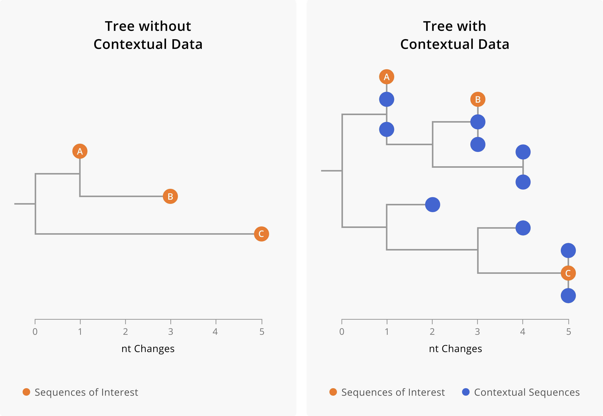
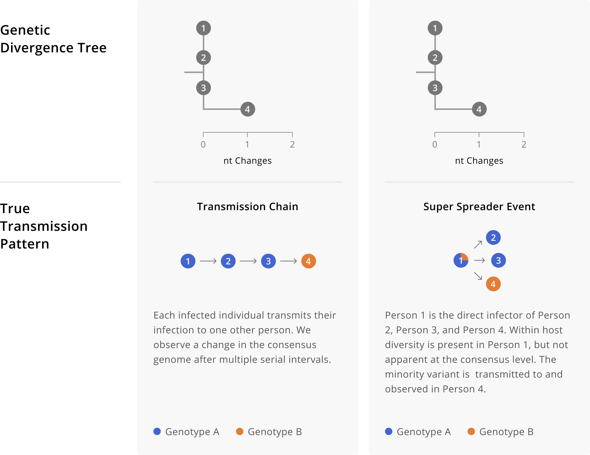

# Broad use cases for genomic epidemiology

_In this chapter we describe thematic areas of genomic epidemiological analysis for public health investigations. For each of these areas, we provide concrete examples of the types of questions that fall within these topical areas, the fundamental theoretical principles that you will draw upon to investigate those questions, and different sampling schemes and analysis methods for investigating those questions. This chapter is pertinent to most readers, as it describes the public health utility of different genomic epidemiologic analyses. Additionally, readers engaged in building genomic epidemiological capacity or in performing genomic epidemiology themselves will benefit from the descriptions of how to design, analyze, and interpret various genomic epidemiological investigations._

## Assessing linkage between cases

### What kinds of questions fall into this topic?

* Both of these cases have similar reported exposures. Is that common exposure the likely source of both infections?

* I have multiple detections of disease in the workplace. Is workplace transmission occurring, or were unrelated community-acquired infections detected at the same time?

* I have multiple cases that were assigned the same Pango lineage. Are these cases closely-related?

* There is an outbreak going on in our prison system, and there are also cases in our intake jails. Are infections in intake jails contributing to prison outbreaks?

* I have two detections of a variant of concern from the same week, and I’ve never seen that variant in my jurisdiction before. Do these cases represent community transmission of the variant of concern, or are these cases independent introductions?

* I’ve detected two cases of a disease in the same household. Is this an instance of household transmission, or did the cases contract the disease separately outside the home?

### Fundamental principles

As a pathogen, let’s say a virus, circulates in a population, it infects different people. During those infections, the virus replicates, making errors as it copies its genome for packaging into progeny virions. While different pathogens make errors at different rates, and we may see substitutions in consensus genomes at different rates (see Chapter 3 - mutations versus substitutions), this principle means that pathogen genome sequences will accumulate changes over the course of an outbreak. This process also means that cases separated by a minimal amount of transmission will generally have more genetically similar infections, while cases that are separated by large amounts of transmission will typically have more genetically divergent infections.

### What kind of sampling do you need to answer the question?

When you are looking at the pathogen genome sequences of two infections you are not extrapolating from those data to a broader understanding of the outbreak as a whole. Therefore, you can assess possible linkages between cases using sequences collected through either a targeted sampling scheme or a representative sampling scheme. That said, it remains important to include contextual sequence data in your analysis, as described in Chapter 3 and as shown in Figure 5.1 below.

```{r contextual-data, fig.cap='A toy example showing the importance of including contextual data when assessing linkage between cases. On the left-hand side is a phylogenetic tree including only three samples of interest. On the right-hand side, we show a phylogenetic tree of the same three samples of interest (orange tips) along with closely-related contextual data (blue tips). The addition of contextual data clarifies the relationships between the samples of interest. In the tree on the left, we might assume that A and B are related cases, since they both share a mutation and are only two nucleotides diverged from each other. However, the addition of contextual data (blue) provides a more nuanced picture. We see that samples of interest A and B are in fact more closely related to contextual sequences than they are to each other. This could mean that A and B are not directly epidemiologically-linked, or it might mean that A and B are both part of a larger transmission chain captured by the contextual sequences. Furthermore, contextual data can make it more clear when samples are diverged. While we can see substantial genetic divergence between sample C and samples A and B in the tree on the left, the addition of contextual data makes it more clear that C is unrelated to samples A and B.', out.width='80%', fig.asp=.75, fig.align='center', echo=FALSE}

```

### What tools or approaches can you use to answer the question?

To investigate questions of linakge you will need a way to compare and summarize the genetic similarity between cases of interest. There are multiple methods for summarizing genetic distances between samples, but we generally recommend using tree structures such as **phylogenetic placements** or **phylogenetic trees** (see Chapter 7 for more details) when assessing sequence similarity between samples.

While it is technically possible to build a tree structure with just your samples of interest, we caution against doing this, as the addition of other contextual sequences usually makes the relationships between your samples of interest more clear. Furthermore, in the case that your samples of interest _are not_ genetically similar to each other, the presence of contextual sequences allows you to see other samples that they _are_ closely-related to (Figure 5.1).

Both phylogenetic placements and phylogenetic trees will provide a tree structure for assessing similarity between samples of interest. However, during public health investigations, our questions about the genetic similarity of samples of interest are usually limited in scope and we need answers quickly. When rapid situational awareness is more important than a richer analysis, we recommend performing a phylogenetic placement. If after performing a phylogenetic placement you have further descriptive epidemiological questions about the samples, then we recommend following-up a phylogenetic placement with inferring a phylogenetic tree.


### Caveats, limitations, and ways things go wrong

As discussed in Chapter 3, genomic data are powerful for ruling linkage _out_, but less powerful for unequivocally ruling linkage _in_. Furthermore, except in rare cases, you cannot infer the directionality of transmission from sequence data alone when you have highly genetically-similar consensus genomes. This principle is probably clearest when cases have identical genome sequences, since if all of the sequences are the same there's no genomic signal for directionality. However, we caution that directionality is still challenging to infer accurately even when some genomes are slightly diverged. As an example of this issue, in Figure 5.2 we illustrate two different transmission patterns that yield the sample phylogenetic tree topology. In the first scenario, we have a person-to-person transmission pattern, where directionality is A to B to C to D. In the second scenario we instead have a superspreading event, in which individual A directly infects person B, person C, and person D. Despite having different transmission patterns, the genetic divergence trees are identical. This example shows how challenging it can be to disentangle genetic diversity accrued during person-to-person transmission from within-host diversity that is transmitted when an index case infects multiple secondary cases.

```{r within-host-versus-chain, fig.cap='Different transmission patterns between individuals A, B, C, and D can yield identical genetic divergence trees. On the left we show a transmission chain in which individual A infects B, who infects C, who then infects D. Depending on the evolutionary rate of our pathogen, we may not see mutations arise in every single consensus genome. Indeed, here we see that the sequences from individuals A, B, and C are identical. Thus without knowledge of the true transmission pattern, we would not be able to detect the directionality of transmission between those three individuals. Furthermore, while one might initially think that directionality for individual D is possible to infer, comparison of the scenarios on the left and right show how directionality can become convoluted by within-host diversity. On the left, individual D’s consensus sequence shows an additional nucleotide change on top of the background genotype of A, B, and C, which was accrued over the process of transmission between individuals. In contrast, on the right that same pattern of diversity is present within individual A’s infection. Then, during a superspreading event in which A infects individuals B, C, and D directly, that within-host diversity is captured at the consensus level of the secondary infections. These toy trees are consistent with still more additional true transmission patterns that are not enumerated here. As an exercise you might want to try sketching additional possibilities out.', out.width='80%', fig.asp=.75, fig.align='center', echo=FALSE}

```

Additionally, in much the same way that contextual data may change your understanding of linkage between cases, lacking sequences from infections may also change your interpretation of linkage. When assessing linkage between cases, we recommend keeping your sampling frame in mind. If you're assessing linkage between two samples collected through representative surveillance, then consider what proportion of cases you sequence. If you sequence only a small proportion of cases, then there may be intervening cases along a transmission chain that go unsequenced, and therefore do not appear in a phylogenetic tree. In that case, genetically-similar samples could be part of the same transmission chain, but not necessarily directly epidemiologically linked.

Finally, some molecular epidemiological methods suggest using SNP distances and thresholds for ruling cases into the same outbreak or categorizing them as belonging to different outbreaks. While we understand how thresholds can make decision making easier, we generally discourage using SNP thresholds. This is because using SNP thresholds reduces the granularity of the data; they make a binary assessment (in or out of outbreak) when in fact the data are continuous (0, 1, 2, 3 ... SNPs separating two sequences). While reducing the data down to a single binary outcome does make assessment easier, it does so by hiding nuance and uncertainty, which is critical for making epidemiologic inferences and assessing your confidence in them. Furthermore, making genetic distance into a binary call results in a loss of information. Pathogens accrue mutations at specific evolutionary rates, thus the actual count of differences between two sequences provides a quantitative estimate of how related or unrelated two sequences are.

### Relevant case studies

* Ruling out a putative index case during a SARS-CoV-2 outbreak.

* Are cases of the same Variant of Concern lineage linked?
