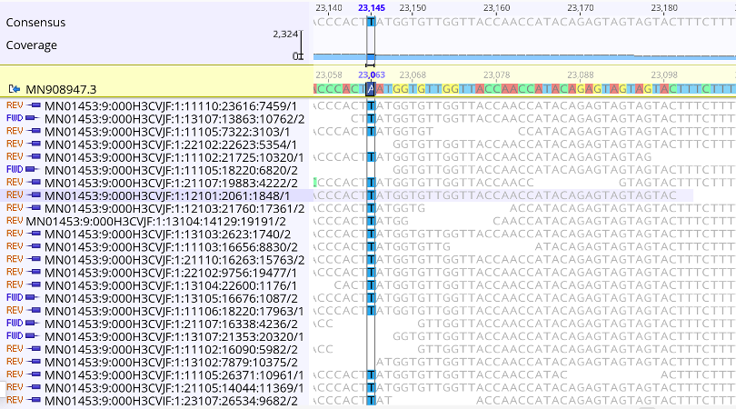
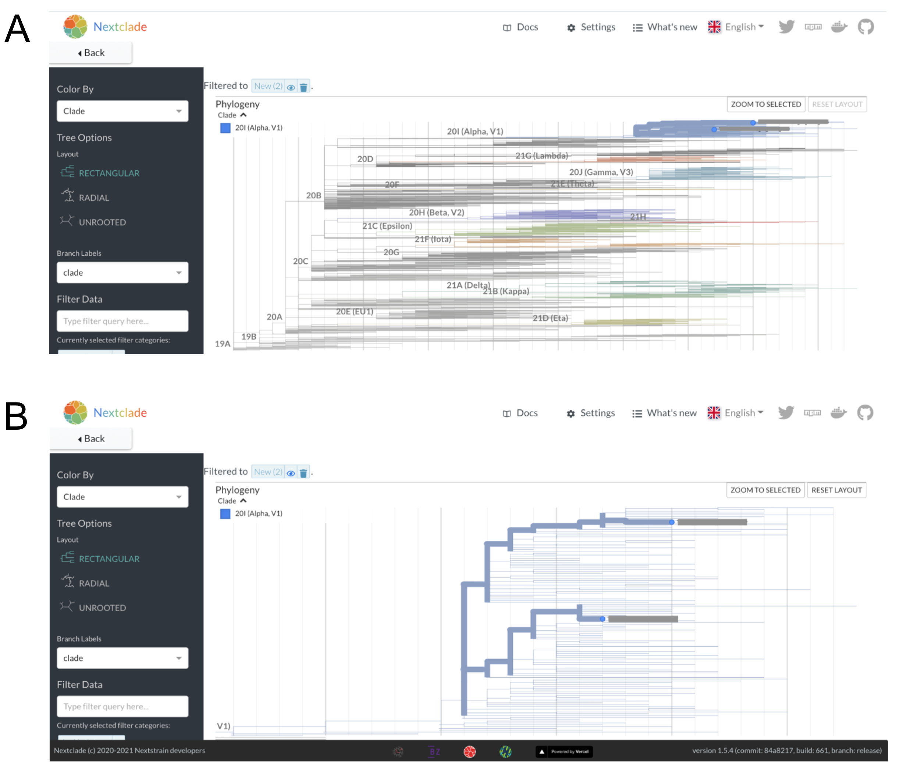

# Case studies

_In this Chapter, we provide case studies exemplifying how the broad thematic areas of genomic epidemiological analysis described in Chapter 5 can manifest in practice. These case studies illustrate step-by-step how different questions were investigated with a genomic epidemiological approach. Rather than providing the kinds of neat and cohesive narratives we frequently see in peer-reviewed literature, we have tried to show how hands-on investigations really proceed, including evaluating competing hypotheses and describing sources of uncertainty in our analyses. This chapter is pertinent to readers who will be directly involved in analyzing and interpreting genomic epidemiological studies, or who want to see examples of genomic epidemiology in practice._

## Are cases of the same Variant of Concern lineage linked?

At the beginning of 2021, public health authorities within the United States were concerned about the transmission of the B.1.1.7 lineage (“Alpha” within the WHO nomenclature system), which appeared to be more transmissible than previous strains of SARS-CoV-2. Already the dominantly-circulating lineage within the United Kingdom, public health agencies within the United States were interested in whether B.1.1.7 had already arrived in the United States, and if so, how it was distributed and at what frequency. Genomic surveillance activities were established and intensified to investigate these questions. Beyond estimating frequency, some  public health agencies also monitored for individual cases infected with “Variant of Concern” lineages, which they might prioritize for more aggressive contact tracing and control efforts to limit the establishment and growth of VOC lineages within the jurisdiction.

County A is a predominantly rural county, in which diagnostic testing and genomic surveillance are primarily handled by the local public health laboratory. The county started an in-house SARS-CoV-2 sequencing program at the beginning of 2021, and had regular sequencing and lineage assignment protocols in place during the spring of 2021, when they detected their first two cases of B.1.1.7 lineage-viruses among two residents of the county. The two cases were detected and sampled during the same week, a timeline that was consistent with one case infecting the other, resulting in an epidemiologically-linked pair. Beyond the timing of the two infections, epidemiological-linkage between the cases seemed possible since both cases were assigned the same lineage (B.1.1.7), and no other B.1.1.7 cases had been detected in County A up to this point. However, while Pango lineage assignments can provide a useful summary of different genetic lineages, most Pango lineages have genetic diversity within the lineage. Especially for lineages whose frequency grows significantly, such as B.1.1.7, there may be many different transmission chains of B.1.1.7 viruses circulating within different geographic areas. In such cases, phylogenetic analyses can provide higher resolution for refining relationships between cases.

In response to these detections, County A undertook a rigorous analysis of the whole genome sequences from these two cases. Firstly, since these were the first B.1.1.7 cases detected in the county, County A wanted to verify the accuracy of the lineage calls. To do so, they looked at the `.bam` files, which show the actual sequencing read data mapped to a reference genome. To confirm the quality of the B.1.1.7 lineage defining SNP calls, they looked at the total number of reads that covered the lineage-defining site, and looked for the particular SNP call in each of the reads (Figure 5.1). This process was repeated for all B.1.1.7 defining sites.

```{r county-a-bam, fig.cap='A zoomed in picture of site 23063 in the nucleotide sequence, where the reference sequence has an A and the sequencing reads show that this infection has a T at this site. The A23063T mutation in the nucleotide sequence corresponds to an N501Y substitution in Spike protein, which is one of multiple lineage defining mutations for B.1.1.7. At this site there are 390 distinct, high quality sequencing reads that support this call. Furthermore, both forward and reverse reads detect this nucleotide, further demonstrating that this call is real.', out.width='80%', fig.asp=.75, fig.align='center'}

```

Next, County A took the two confirmed B.1.1.7 lineage viruses and imported the sequences into Nextclade in order to assess their quality. The sequences showed minimal numbers of Ns, no mixed sites, and a reasonable number of mutations as compared to the Wuhan-Hu-1 reference genome (Figure 5.2). This indicates that the sequences are high quality, and appropriate for analysis. Notably, the sequences do have frameshift mutations in them, which is why the Nextclade F metric is red (Figure 5.2). While sometimes real, these frameshifts are often a bioinformatic artifact from the consensus genome assembly pipeline. While the author of a genome sequence will typically have to fix or document a frameshift for public repositories to accept the sequence, one can still use them in phylogenetic pipelines that “strip” these frameshifts away.

Looking at the two sequences together in the Nextclade alignment viewer, we can see that both samples share some SNPs, as indicated by the colored bars (Figure 5.2). This makes sense since we know that both samples are B.1.1.7 lineage viruses. However, we can also see that there are differences between the two sequences as well (Figure 5.2). Each sample has numerous additional SNPs that are unique to the sample. This indicates that these samples are likely not directly related. The next paragraph will discuss that logic in more depth, and show how we can see that genetic divergence on the phylogenetic placement available in Nextclade.

```{r county-a-quality, fig.cap='The two B.1.1.7 lineage viruses as visualized in Nextclade (sequence names are intentionally masked). Notably, all quality metrics show that the sequences are of high quality, except for the “F” metric, which indicates that a frameshift mutation has been detected. The sequence view shows that the two sequences share many SNPs, but also have some unique SNPs that are not found in the other sequence.', out.width='80%', fig.asp=.75, fig.align='center'}
knitr::include_graphics("figures/06_county-a-quality.png")
```

In Nextclade we can take our two sequences and “graft” them onto a pre-inferred Nextstrain phylogeny in a process that is termed “phylogenetic placement”. The sequences are placed onto the tree according to the patterns of substitutions that the tree summarizes, and that your sequences have. The sequences of interest are placed onto the tree at the point where most of the SNPs in your genome sequence have also been observed in the tree. Then, any mutations that are unique to your sample, and not yet detected in the background tree, are shown as branch length leading from the tree to the sample of interest. In Figure 5.3A below, we can see that both sequences group in the Alpha lineage portion of the tree, consistent with their designation as B.1.1.7 lineage viruses. When we zoom in to the Alpha clade of the tree, we can see that despite both viruses receiving a B.1.1.7 assignment, they are quite diverged (Figure 5.3B). Indeed, these two B.1.1.7 sequences are separated by 13 SNPs (Figure 5.2 and Figure 5.3B). This is much more genetic divergence than we would expect to see if the sequences were epidemiologically-linked.

```{r county-a-placement, fig.cap='A) Nextclade phylogenetic placement of the two B.1.1.7 sequences onto a background Nextstrain tree. Nextclade places both of these sequences on the tree within the Alpha clade, consistent with the Pango lineage assignments and our visual assessment of the sequencing reads. B) A zoomed in view of the two sequences within the Alpha lineage of the tree shows that they are placed onto different parts of the tree within the Alpha clade. You can count the number of nucleotides changes separating the two viruses by “walking the path” of the highlighted branches between the two samples, counting up the number of nucleotide changes observed on each segment of the path as you go. An important note is that the vertical axis has no meaning, thus you are only summing up the number of SNPs observed along the horizontal branches.', out.width='80%', fig.asp=.75, fig.align='center'}

```

For an in-depth discussion of different thresholds of divergence, please see “Why sequencing is better at dismissing links than confirming them” in the Fundamental Theory chapter. However, we can also do a back-of-the envelope calculation to provide some context about what a 13 SNP difference means. Firstly, we should note that the average evolutionary rate of SARS-CoV-2 is roughly 24.5 substitutions across the entire genome per year (see Figure 5.4). This means that if we were to randomly sample two sequences that were sampled a year apart from each other, we would expect them on average to be 24.5 SNPs different from each other. If you were looking at the actual divergence between two sequences, the SNP difference counts would be whole numbers, but this rate is the average value if you were to repeat that sampling procedure many times over. If we take our two samples from County A that are separated by 13 SNPs and think about what this distance means in light of the evolutionary rate of the virus, we can say that roughly 6 months worth of transmission separates these two infections.

```{r county-a-clock, fig.cap='The clock view from the global SARS-CoV-2 Nextstrain build maintained by the Nextstrain team (available at https://nextstrain.org/ncov/gisaid/global?l=clock). Each circle in this plot represents a sampled virus (a tip in the tree), and it’s position in the plot is determined by the date the virus was sampled and the number of SNPs that it has compared to the Wuhan-Hu-1 reference genome. The evolutionary rate estimate comes from the slope of a least-squares line fit through the data points.', out.width='80%', fig.asp=.75, fig.align='center'}
knitr::include_graphics("figures/06_county-a-clock.png")
```

What does this mean from a public health standpoint? County A can be confident that these two cases are not linked - the genome sequences are too diverged for that to be likely. Thus, these two cases of B.1.1.7 more likely represent independent introductions of B.1.1.7 into the county. This means that these two cases do not represent a transmission event of B.1.1.7 within County A. Rather, these two cases were likely separately infected somewhere else outside the county, and then returned home where they were tested for COVID-19. At this point, case interviews could be helpful for discerning whether these cases recently traveled, or what exposure event may have led them to contract a lineage that had not previously been detected in County A. Furthermore, since these two cases do not represent sustained transmission within the county, aggressive contact tracing efforts might be warranted in order to prevent establishment of B.1.1.7 circulation in the county.
