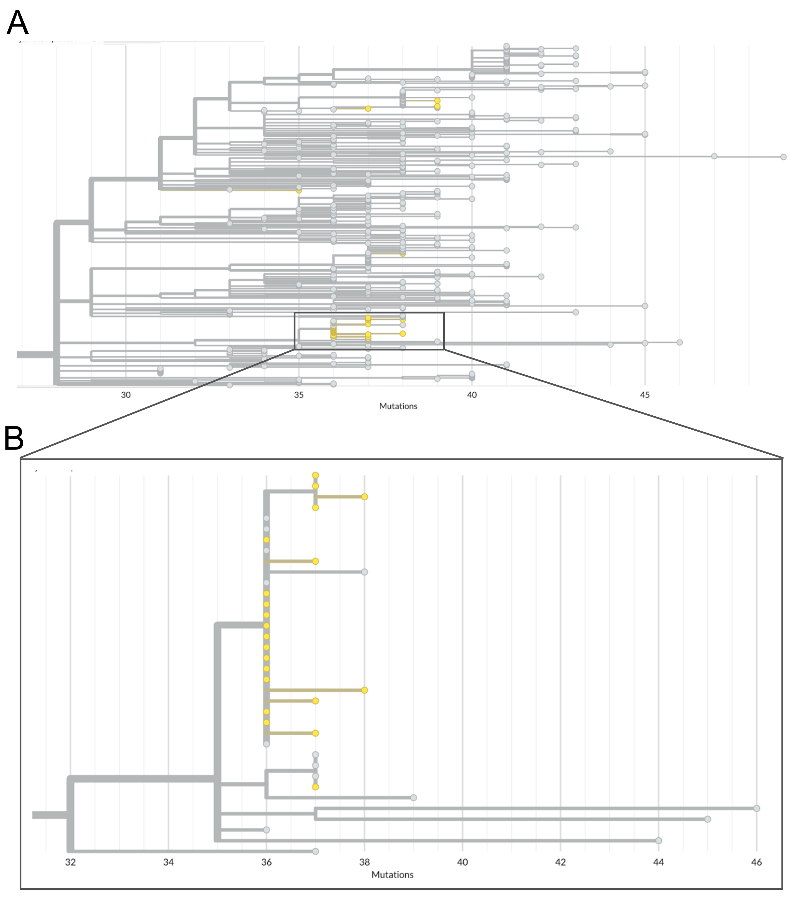
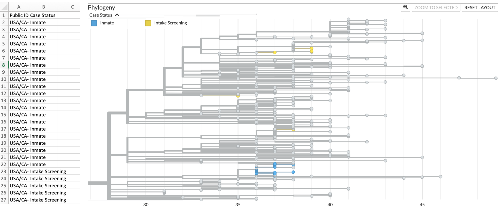
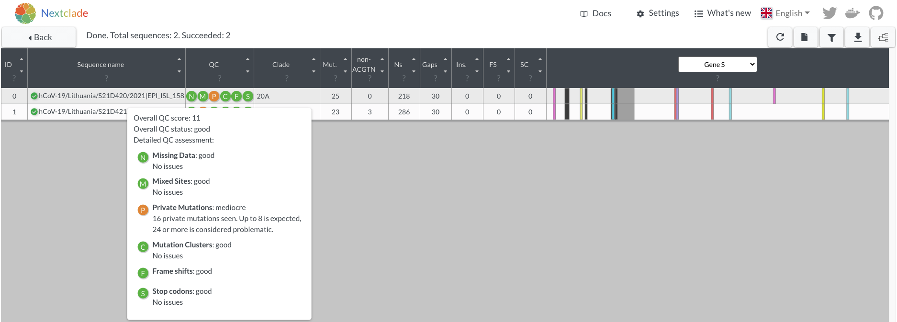
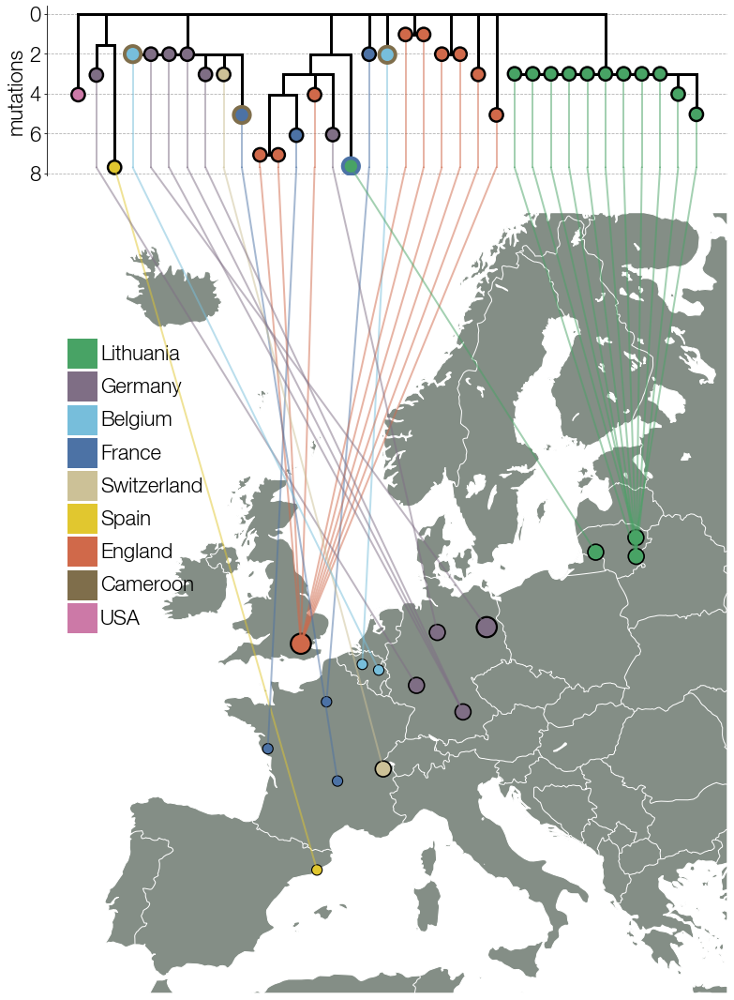

# Case studies

_In this Chapter, we provide case studies exemplifying how the broad thematic areas of genomic epidemiological analysis described in Chapter 5 can manifest in practice. These case studies illustrate step-by-step how different questions were investigated with a genomic epidemiological approach. Rather than providing the kinds of neat and cohesive narratives we frequently see in peer-reviewed literature, we have tried to show how hands-on investigations really proceed, including evaluating competing hypotheses and describing sources of uncertainty in our analyses. This chapter is pertinent to readers who will be directly involved in analyzing and interpreting genomic epidemiological studies, or who want to see examples of genomic epidemiology in practice._

## Are cases of the same Variant of Concern lineage linked?

At the beginning of 2021, public health authorities within the United States were concerned about the transmission of the B.1.1.7 lineage ("Alpha" within the WHO nomenclature system), which appeared to be more transmissible than previous strains of SARS-CoV-2. Already the dominantly-circulating lineage within the United Kingdom, public health agencies within the United States were interested in whether B.1.1.7 had already arrived in the United States, and if so, how it was distributed and at what frequency. Genomic surveillance activities were established and intensified to investigate these questions. Beyond estimating frequency, some  public health agencies also monitored for individual cases infected with "Variant of Concern" lineages, which they might prioritize for more aggressive contact tracing and control efforts to limit the establishment and growth of VOC lineages within the jurisdiction.

County A is a predominantly rural county, in which diagnostic testing and genomic surveillance are primarily handled by the local public health laboratory. The county started an in-house SARS-CoV-2 sequencing program at the beginning of 2021, and had regular sequencing and lineage assignment protocols in place during the spring of 2021, when they detected their first two cases of B.1.1.7 lineage-viruses among two residents of the county. The two cases were detected and sampled during the same week, a timeline that was consistent with one case infecting the other, resulting in an epidemiologically-linked pair. Beyond the timing of the two infections, epidemiological-linkage between the cases seemed possible since both cases were assigned the same lineage (B.1.1.7), and no other B.1.1.7 cases had been detected in County A up to this point. However, while Pango lineage assignments can provide a useful summary of different genetic lineages, most Pango lineages have genetic diversity within the lineage. Especially for lineages whose frequency grows significantly, such as B.1.1.7, there may be many different transmission chains of B.1.1.7 viruses circulating within different geographic areas. In such cases, phylogenetic analyses can provide higher resolution for refining relationships between cases.

In response to these detections, County A undertook a rigorous analysis of the whole genome sequences from these two cases. Firstly, since these were the first B.1.1.7 cases detected in the county, County A wanted to verify the accuracy of the lineage calls. To do so, they looked at the `.bam` files, which show the actual sequencing read data mapped to a reference genome. To confirm the quality of the B.1.1.7 lineage defining SNP calls, they looked at the total number of reads that covered the lineage-defining site, and looked for the particular SNP call in each of the reads (Figure 5.1). This process was repeated for all B.1.1.7 defining sites.

```{r county-a-bam, fig.cap='A zoomed in picture of site 23063 in the nucleotide sequence, where the reference sequence has an A and the sequencing reads show that this infection has a T at this site. The A23063T mutation in the nucleotide sequence corresponds to an N501Y substitution in Spike protein, which is one of multiple lineage defining mutations for B.1.1.7. At this site there are 390 distinct, high quality sequencing reads that support this call. Furthermore, both forward and reverse reads detect this nucleotide, further demonstrating that this call is real.', out.width='80%', fig.asp=.75, fig.align='center', echo=FALSE}

```

Next, County A took the two confirmed B.1.1.7 lineage viruses and imported the sequences into Nextclade in order to assess their quality. The sequences showed minimal numbers of Ns, no mixed sites, and a reasonable number of mutations as compared to the Wuhan-Hu-1 reference genome (Figure 5.2). This indicates that the sequences are high quality, and appropriate for analysis. Notably, the sequences do have frameshift mutations in them, which is why the Nextclade F metric is red (Figure 5.2). While sometimes real, these frameshifts are often a bioinformatic artifact from the consensus genome assembly pipeline. While the author of a genome sequence will typically have to fix or document a frameshift for public repositories to accept the sequence, one can still use them in phylogenetic pipelines that "strip" these frameshifts away.

Looking at the two sequences together in the Nextclade alignment viewer, we can see that both samples share some SNPs, as indicated by the colored bars (Figure 5.2). This makes sense since we know that both samples are B.1.1.7 lineage viruses. However, we can also see that there are differences between the two sequences as well (Figure 5.2). Each sample has numerous additional SNPs that are unique to the sample. This indicates that these samples are likely not directly related. The next paragraph will discuss that logic in more depth, and show how we can see that genetic divergence on the phylogenetic placement available in Nextclade.

```{r county-a-quality, fig.cap='The two B.1.1.7 lineage viruses as visualized in Nextclade (sequence names are intentionally masked). Notably, all quality metrics show that the sequences are of high quality, except for the "F" metric, which indicates that a frameshift mutation has been detected. The sequence view shows that the two sequences share many SNPs, but also have some unique SNPs that are not found in the other sequence.', out.width='80%', fig.asp=.75, fig.align='center', echo=FALSE}
knitr::include_graphics("figures/06_county-a-quality.png")
```

In Nextclade we can take our two sequences and "graft" them onto a pre-inferred Nextstrain phylogeny in a process that is termed "phylogenetic placement". The sequences are placed onto the tree according to the patterns of substitutions that the tree summarizes, and that your sequences have. The sequences of interest are placed onto the tree at the point where most of the SNPs in your genome sequence have also been observed in the tree. Then, any mutations that are unique to your sample, and not yet detected in the background tree, are shown as branch length leading from the tree to the sample of interest. In Figure 5.3A below, we can see that both sequences group in the Alpha lineage portion of the tree, consistent with their designation as B.1.1.7 lineage viruses. When we zoom in to the Alpha clade of the tree, we can see that despite both viruses receiving a B.1.1.7 assignment, they are quite diverged (Figure 5.3B). Indeed, these two B.1.1.7 sequences are separated by 13 SNPs (Figure 5.2 and Figure 5.3B). This is much more genetic divergence than we would expect to see if the sequences were epidemiologically-linked.

```{r county-a-placement, fig.cap='A) Nextclade phylogenetic placement of the two B.1.1.7 sequences onto a background Nextstrain tree. Nextclade places both of these sequences on the tree within the Alpha clade, consistent with the Pango lineage assignments and our visual assessment of the sequencing reads. B) A zoomed in view of the two sequences within the Alpha lineage of the tree shows that they are placed onto different parts of the tree within the Alpha clade. You can count the number of nucleotides changes separating the two viruses by "walking the path" of the highlighted branches between the two samples, counting up the number of nucleotide changes observed on each segment of the path as you go. An important note is that the vertical axis has no meaning, thus you are only summing up the number of SNPs observed along the horizontal branches.', out.width='80%', fig.asp=.75, fig.align='center', echo=FALSE}
knitr::include_graphics("figures/06_county-a-phylo-placement.png")
```

For an in-depth discussion of different thresholds of divergence, please see "Why sequencing is better at dismissing links than confirming them" in the Fundamental Theory chapter. However, we can also do a back-of-the envelope calculation to provide some context about what a 13 SNP difference means. Firstly, we should note that the average evolutionary rate of SARS-CoV-2 is roughly 24.5 substitutions across the entire genome per year (see Figure 5.4). This means that if we were to randomly sample two sequences that were sampled a year apart from each other, we would expect them on average to be 24.5 SNPs different from each other. If you were looking at the actual divergence between two sequences, the SNP difference counts would be whole numbers, but this rate is the average value if you were to repeat that sampling procedure many times over. If we take our two samples from County A that are separated by 13 SNPs and think about what this distance means in light of the evolutionary rate of the virus, we can say that roughly 6 months worth of transmission separates these two infections.

```{r county-a-clock, fig.cap='The clock view from the global SARS-CoV-2 Nextstrain build maintained by the Nextstrain team. Each circle in this plot represents a sampled virus, the same as a tip in the tree, and the x and y positions in the plot are determined by the date the virus was sampled and the number of SNPs that it has compared to the Wuhan-Hu-1 reference genome respectively. The evolutionary rate estimate comes from the slope of a least-squares line fit through the data points.', out.width='80%', fig.asp=.75, fig.align='center', echo=FALSE}
knitr::include_graphics("figures/06_county-a-clock.png")
```

What does this mean from a public health standpoint? County A can be confident that these two cases are not linked - the genome sequences are too diverged for that to be likely. Thus, these two cases of B.1.1.7 more likely represent independent introductions of B.1.1.7 into the county. This means that these two cases do not represent a transmission event of B.1.1.7 within County A. Rather, these two cases were likely separately infected somewhere else outside the county, and then returned home where they were tested for COVID-19. At this point, case interviews could be helpful for discerning whether these cases recently traveled, or what exposure event may have led them to contract a lineage that had not previously been detected in County A. Furthermore, since these two cases do not represent sustained transmission within the county, aggressive contact tracing efforts might be warranted in order to prevent establishment of B.1.1.7 circulation in the county.

## Evaluating an intake screening program to prevent introduction of SARS-CoV-2 to prisons.

County C has a large jail housing a considerable number of pre-trial detainees. Given the challenge of controlling SARS-CoV-2 outbreaks in congregate settings, including prisons, public health officials in County C implemented a screening system for COVID-19. The jail had experienced previous outbreaks, and the intent of this screening program was to prevent new introductions of SARS-CoV-2 into the jail, which could seed further outbreaks. As part of the screening program, newly incarcerated individuals were tested for COVID-19 if they consented, and underwent a two week quarantine period prior to being moved into the standard housing units.
The jail recorded cases across multiple residential pods. Given the duration of time over which cases were observed, and the fact that multiple residential pods appeared to be affected, epidemiologists were interested in what processes were contributing to COVID-19 cases within the jail. Was the intake quarantine program ineffective, in which case newly-admitted persons were introducing SARS-CoV-2 into the jail? Or had a previous outbreak within the jail never fully ended?

Given the ability of pathogen genomic sequence data to differentiate between related and unrelated cases, investigators sequenced samples from cases who tested positive during their intake screening quarantine period, and from cases that were detected within the residential pods of the jail. Five sequences were collected from individuals who had tested positive during intake quarantine, and twenty-one sequences were collected from individuals who tested positive while residing in the jail. All of the sequences were assigned the same Pango lineage, thus the lineage information did not provide sufficient information to discern relationships between the samples. Therefore, investigators took these sequences and performed a phylogenetic analysis of jail sequences alongside contextual sequence data that had been collected from County C and other locales through representative surveillance sampling.

The genetic divergence tree in Figure 5.5 below shows the clade grouping 26 sequences sampled from incarcerated individuals (jail sequences are in yellow, contextual data are in grey). Looking at that clade we can see a few important findings. Firstly, some of the jail sequences are genetically diverged, and are more closely related to contextual sequences sampled from the broader community than they are to other sequences collected from incarcerated individuals. Secondly, there is one clade in which samples from the jail have identical consensus genome sequences and sequences that are very closely related to each other. Knowing that genetically-similar infections are more likely to be linked to each other, and that genetically-dissimilar infections are likely unrelated, we can surmise from this tree that some of these cases likely constitute an outbreak, while other cases among incarcerated individuals represent community-acquired infections that are not part of the outbreak.

```{r county-c-tree, fig.cap='Phylogenetic tree of jail sequences and representatively-sampled contextual sequences. A) The top panel of this figure shows the clade within which all jail sequences group with other contextual sequences. Contextual sequences are shown in grey while jail sequences are coloured yellow. In this view you can see the broad distribution of some jail sequences across the entire clade, as well as one cluster of jail sequences which appear closely genetically-related. B) A zoomed-in view of the clade which clusters many jail sequences together. Many of the jail sequences within this cluster have identical genome sequences, and therefore appear stacked vertically along the root node of the outbreak clade. We see other jail sequences within this cluster that appear to have one or two additional nucleotide mutations.', out.width='80%', fig.asp=.75, fig.align='center', echo=FALSE}

```

Knowing that not all of these cases are genetically-related is the first step in evaluating the intake screening program. However, this information alone is not sufficient. What we really want to see is _which_ of these 26 sequences come from cases detected during intake screening, and which cases come from incarcerated individuals living in the residential pods. To combine the genomic picture with this epidemiologic data, we can make use of the functionality in Nextstrain that allows us to overlay additional surveillance data onto a tree. In Figure 5.6 below, we've overlaid the phylogenetic tree with a tsv file that maps "case status" (either inmate or intake screening) to the "strain name" of the sequence in the Nextstrain tree. This allows us to then color the tree according to this new field. In the tree below, we can see that sequences from cases found during intake screening are colored in yellow, while cases detected within the jail are colored in blue.

```{r county-c-overlay, fig.cap='Metadata overlay onto Nextstrain phylogenetic tree differentiates sequences from incarcerated individuals (inmates) and from intake screening. On the left hand side of this figure is a screenshot of the metadata file formatted such that it can be dragged and dropped onto the tree. On the right, we see the same cluster as shown in Figure 5.5, but now jail sequences are coloured according to whether they were sampled from incarcerated individuals residing in pods (blue) or from individuals undergoing intake screening (yellow). Contextual sequences remain coloured in grey.', out.width='80%', fig.asp=.75, fig.align='center', echo=FALSE}

```

This picture helps us understand the following. Firstly, cases detected through the intake screening program **are not** genetically-related to cases that were detected within the jail's residential pods. This means that the observed transmission within the jail's residential units **was not** initiated by any of the sequenced positive cases detected during intake screening. Secondly, intake cases are genetically similar to sequences sampled representatively from surrounding communities. This result supports a scenario in which newly admitted individuals were infected prior to their intake, with those infections discovered during the quarantine period. Thirdly, sequenced cases from intake screening are terminal tips in the tree. By that, we mean that there are no sequences in the tree that descend from infections detected during intake screening. This means that the quarantine period halted onward transmission of SARS-CoV-2.

In contrast, within the clade grouping all sequences sampled from incarcerated individuals living in the residential pods, we see that twelve cases are infected with an identical genotype that is basal to other related genotypes detected among the incarcerated individuals residing in pods (Figure 5.7). Additional samples from incarcerated individuals show additional substitutions accrued on top of the basal genotype. While some of this diversity could represent the transmission of within-host diversity during a super-spreading event, it is also consistent with substitutions accruing over the course of multiple transmission events. The latter scenario, that the accrued genetic diversity is the result of ongoing circulation within the jail, is more likely given that the cases among incarcerated individuals were detected over multiple months.

```{r county-c-jail-cluster, fig.cap='Phylogenetic tree showing the outbreak within the residential pods of the jail. Twelve sequences sampled from incarcerated individuals in the residential pods show identical genome sequences, and are the basal genotype of this clade. There are five contextual sequences that also have this identical genotype. Further investigation of which cases these contextual sequences were sampled from may provide some information regarding how this outbreak was introduced to the jail. Three sequences have an additional unique nucleotide mutation, and one sequence has an additional two nucleotide mutations that are unique to that sample. At the top of this clade we see an additional clade that groups 4 jail samples that all share one additional nucleotide mutation on top of the basal sequence. This pattern of unique and shared diversity, in conjunction with the timeframe over which these samples were collected, suggests ongoing circulation of this clade within the jail over time.', out.width='80%', fig.asp=.75, fig.align='center', echo=FALSE}

```

In terms of public health policy, these findings indicate that the intake screening program is serving its intended effect, namely, preventing new introductions of SARS-CoV-2 into the jail. While it is unclear how the outbreak was introduced into the prison, the most cases within the incarcerated population appear to be related to ongoing transmission within the jail, and thus interventions should focus on controlling transmission within the jail and its residential pods.

## Identifying, assigning, and investigating a new SARS-CoV-2 lineage in Lithuania

Many countries started or expanded their existing sequencing programmes following the announcement of SARS-CoV-2 lineage B.1.1.7 (pango nomenclature) aka alpha (WHO nomenclature) lineage in late December 2020. At the time, the pandemic had been in its first year of circulation in humans and numerous lineages had acquired sufficient mutations to be easily told apart by sequencing, some of the mutations seemingly being selected by high seroprevalence rates in some countries. One striking feature of this diversity had been the same mutations arising independently in multiple lineages, suggesting that similar solutions to common evolutionary pressures were arising in the virus population. In this case study we will examine lineage B.1.620, a globally rare lineage with a striking constellation of mutations and deletions most of which had been seen in individual variants of concern (VOCs) at the time, but not in combination and without evidence of recombination. We will examine the circumstances under which lineage B.1.620 was discovered, how its origins were determined despite limited data, and how to navigate the landscape of competing hypotheses using phylogenetics.

The Lithuanian SARS-CoV-2 sequencing programme, organised by the National Public Health Laboratory and started in February 2021, employed the sequencing capacity of domestic hospitals and universities, as well as the resources of the European Centre for Disease Control (ECDC) reference laboratory. At the time, the programme's maximum capacity enabled sequencing of ~700 SARS-CoV-2 genomes per week. With this degree of sequencing performed on representatively-sampled specimens, and given the SARS-CoV-2 incidence at the time, this level of sequencing should have been sufficient to detect lineages that represented 0.36% of the cases (0.0036 is the upper 95% binomial confidence interval using Jeffrey's method at 0 detections out of 700 samples). During the study period described here, the predominant lineages in Lithuania were B.1.1.7 (designated as alpha in WHO VOC nomenclature) and B.1.177.60, a Lithuanian sublineage of B.1.177 which itself is of Spanish origin and came to dominate in much of Europe in late 2020 due to holiday-goers visiting Spain in summer of 2020 ([Hodcroft et al. 2021](https://www.nature.com/articles/s41586-021-03677-y)).

Sequencing results arriving on the week of April 5 2021 included the typical mixture of predominant B.1.1.7 and B.1.177.60 lineages, with two genomes designated as B.1.177.57 by pango, but which unusually included the amino acid change E484K in the S protein of the virus. These two unusual genomes were also flagged by nextclade as having too many private mutations (i.e. mutations that are not shared with any others in the tree) while their placement on a bigger phylogenetic tree using strict similarity implied that these two sequences could not possibly be B.1.177.57 because they fell in a completely different part of the tree than even basal lineage B.1.177. This mismatch highlighted the differences between methods of classification used by pangolin and by nextclade. As a machine learning-based approach, pangolin cannot cope well with out-of-sample prediction (that is, identify lineages it hasn't seen before) and its underlying decision tree architecture made it sensitive to classify what should be distinct lineages as the same based on shared repeat mutations. Nextclade, on the other hand, attempts to place each SARS-CoV-2 genome query on a reference tree by identifying nodes whose sequence is most similar to a query. Based on the mutations, the two new unusual sequences could not possibly be derived from B.1.177 and known methodological differences between pangolin and nextclade made it clear that pangolin was in error. In nextclade nomenclature, the two new unusual sequences were designated as belonging to clade 20A, corresponding to pango lineage B.1, a basal and diverse SARS-CoV-2 genotype. We will refer to this lineage as lineage X until its official designation in the story.

```{r b1620-nextclade, fig.cap='Spike protein changes and nextclade warnings of the two mystery genomes. Because the reference tree has been updated since these genomes were described, private mutation warnings are not as extreme as they were at the time of discovery.', out.width='80%', fig.asp=.75, fig.align='center', echo=FALSE}

```

To better understand this new and unusual lineage X, its constellation of mutations and deletions was examined. Most prominent amongst the mutations present was E484K in the Spike protein, which had been predicted early in the epidemic to have a significant impact on neutralising antibody titres raised against lineages without this mutation. Other mutations and deletions found in lineage X were known from other VOCs: ORF1a: 3675/3677Δ (highly convergent deletion in multiple VOCs), S: P26S (found in P.1), S: 69/70del (found in B.1.1.7), S: 144/145del (found in B.1.1.7), S: 241/243del (found in B.1.351), S: H245Y, S: S477N, S: E484K (all found in B.1.351, P.1), S: P681H (found in B.1.1.7), S: T1027I (found in P.1), S: D1118H (found in B.1.1.7), and N: A220V (found in B.1.177 and likely responsible for incorrect pango classification of lineage X as B.1.177.57). GISAID, the _de facto_ global repository of SARS-CoV-2 genomes, allows the user to carry out simple queries for genomes in the database. Many of the mutations that lineage X carried were already set up as possible mutation queries because of other VOCs, and it was possible to use combinations of mutations that had not been seen in any other lineage together.

```{r b1620-muts, fig.cap='Mutations unique to the mystery lineage X (which became B.1.620) are shown in red, blue highlights amino acid changes present in other VOCs and VOIs of the time.', out.width='80%', fig.asp=.75, fig.align='center', echo=FALSE}
knitr::include_graphics("figures/06-B1620-muts.png")
```

Searching GISAID for genomes that carried mutations S: E484K, S: S477N, and S: 69/70del identified 40-odd additional genomes that also carried the remaining constellation of mutations and deletions characteristic of lineage X. Two cases of lineage X from mid-March were retrospectively identified on GISAID in this way which were missed initially because of pango misclassification. Other genomes on GISAID were submitted by labs sequencing in Belgium, France, Germany, Switzerland, UK, and Spain. All genomes available at the time were one or more mutations away from the common ancestor genotype, none clustered strongly according to country, and lineage X was not dominant in any of the countries where it was detected. If the origin location of this lineage had an intensive sequencing programme, their sequence data would likely detect certain features, such as high prevalence of lineage X within the origin region, evidence of lineage's gradual evolution and/or rise to higher frequency after originating (for example, shown by a phylogenetic pattern where genotypes detected in the origin region sit roughly basal to diversity seen elsewhere). None of the countries where lineage X had been found at the time fit any of these features, strongly suggesting that the _actual_ origin location was not represented by the sequences on GISAID.


```{r b1620-early-tree, fig.cap='Early lineage X genomes collected from different countries in Europe. Known travel cases are indicated with outlines corresponding to country of origin.', out.width='80%', fig.asp=.75, fig.align='center', echo=FALSE}

```

This suspicion was strengthened by the identification of one lineage X genome on GISAID from France that came from an infected traveler coming to France from Cameroon. Authors of other lineage X sequences on GISAID were contacted personally by email to inquire about potential travel histories of patients from whom lineage X had been sequenced. Of the authors who reported back information, a surprisingly large number of lineage X genomes (around 10) had been collected from travelers coming from Cameroon to Switzerland, France, and Belgium. Some authors could not provide travel information because their organisations had deemed travel information to be sensitive and personally identifiable information. Personal information protection is an important and sensitive topic in genomic epidemiology, and there are varied opinions and regulations defining what counts as personally identifying information. These challenges can make collating the same information fields from multiple sources challenging or impossible.

As more information was being pursued, an official pango lineage designation was requested for lineage X. The nomenclature system devised by the Pango Network to refer to distinct SARS-CoV-2 lineages has been extremely helpful for communication between scientists. With an official designation of lineage X as B.1.620, it was possible for personnel used to just looking at lineage composition to notice this unusual lineage, which would otherwise be assigned a different lineage. The designation also gave researchers around the world common vocabulary to discuss this lineage without having to refer to all of its mutations and deletions. An unexpected benefit of an official designation was that it tempered headlines in national and international media that referred to lineage B.1.620 (prior to designation) as an "unidentified coronavirus strain", a needlessly ominous term likely to grab attention and add to confusion when communicating with the public later.

```{r b1620-news, fig.cap='Healthcare emergencies can be accompanied by unhelpful attention from media outlets.', out.width='80%', fig.asp=.75, fig.align='center', echo=FALSE}
knitr::include_graphics("figures/06-B1620-news.png")
```

The already strong case for an African origin of lineage B.1.620, due to the lineage's association with travelers arriving from Cameroon, became even stronger with the help of African collaborators. Scientists working in the Central African Republic (CAR) near the border with Cameroon shared six B.1.620 genomes, at last confirming that B.1.620 actually circulated in the region. As more African countries began or expanded sequencing programmes, B.1.620 was eventually found in CAR, Cameroon, Gabon, Democratic Republic of the Congo, Republic of the Congo, Equatorial Guinea, and Angola. While most travelers infected with B.1.620 had arrived from Cameroon, CAR turned out to have the highest frequency of B.1.620, despite low numbers of sequenced SARS-CoV-2 genomes. Neighbouring Republic of the Congo turned out to have the second highest frequency of lineage B.1.620 in the world, though sequencing data showed up very late.

```{r b1620-outbreak-info, fig.cap='To date the highest frequency of B.1.620 genomes are observed in central Africa.', out.width='80%', fig.asp=.75, fig.align='center', echo=FALSE}
knitr::include_graphics("figures/06-B1620-outbreakinfo.png")
```

All of the evidence together suggests that lineage B.1.620 arrived to Europe from Cameroon on multiple occasions but CAR is more likely to have been the location where B.1.620 became a dominant variant, if not its birthplace. This highlights an important aspect of sequence data, namely that all available information should be brought to bear when interpreting sequence data.

Another issue that plagued the B.1.620 investigation were sequencing errors and assembly artefacts. Sequencing labs often have variable access to the tools and expertise necessary for assembling high quality genomes, and this can result in variable sequence quality. One of the labs submitting B.1.620 genomes to GISAID, for example, were able to recover genomes containing all the mutations expected of the lineage, but did not include the deletions. It would be extremely unlikely to sample a precursor lineage to B.1.620 in Europe which happened to have only the mutations but not the deletions typical of the lineage. A far more parsimonious explanation was that the reference-based assembly method used by the lab did not handle _indels_ (insertion and deletion changes) well. Sequences like these were excluded from analyses because the presence or absence of indels altered their phylogenetic placement.

Another intriguing case was found in Lithuanian data where a genome occupying an intermediate position along the long branch leading to all known B.1.620 genomes was discovered weeks into the B.1.620 outbreak in the country. At face value the interpretation of such phylogenetic placement is that B.1.620 evolved in Lithuania. Given the intensity of Lithuania's genomic surveillance programme, and convincing evidence that B.1.620 had come from central Africa, the sample was inspected in greater detail. The genome itself contained mutations typical of B.1.620 but other sites with non-reference nucleotides contained mutations typical of lineage B.1.177.60. At this point there were two hypotheses; either this was a recombinant sequence or a co-infection.

As we discuss in greater detail in the Recombination section of the the Further concepts chapter, some of the key signals the recombination leaves were missing from this sample. For example, the mosaic pattern was only observed in this single sample. Furthermore, the actual pattern of the mosaic pattern of mutations, where B.1.620-like and B.1.177.60-like mutations occurred randomly across the entire genome, did not indicate recombination. Rather, _bona fide_ recombinants observed in the UK had patterns of mosaic mutations that clustered towards one or the other end of the genome.

To conclusively rule-in co-infection, the assembly files were investigated, specifically the frequencies of each non-reference nucleotide. All non-reference nucleotides for that sample had a nearly 50-50 split in frequencies between B.1.620-like and B.1.177.60-like alleles, exactly as expected from co-infection. Calling a consensus sequence from this read data, particularly when the two alternative alleles are so close in frequency, results in the mosaic we saw initially. This sequence was subsequently removed from databases and excluded from future analyses.

```{r b1620-coinfection, fig.cap='Screenshot of a nextstrain build showing an early-branching sample (bottom) from Lithuania. This early branching sample had only some of the mutations found in B.1.620, implying that it diverged from a lineage that eventually gave rise to B.1.620, an impossibility considering all the evidence pointing to central Africa as the region from which B.1.620 reached Europe. This sample was later identified as an incorrectly assembled genome from a co-infection case with B.1.177.60 and B.1.620 lineages.', out.width='80%', fig.asp=.75, fig.align='center', echo=FALSE}

```

An overarching lesson from B.1.620 is that, while sequencing data can provide a wealth of information, you shouldn't interpret it in isolation from all other information you may have. Sequencing error, incorrectly labeled genomes, incorrectly annotated metadata, sequence classification tools, etc can all result in either individual or sets of observations that seemingly go against a developing hypothesis. It is therefore key to integrate as many sources of information as possible into a genomic epidemiological investigation, such that the entirety of the body of evidence is cohesive with the sequence data. And it's good to retain skepticism of sequence data that don’t conform, since sequence data issues often leave imprints that are easy to diagnose.
