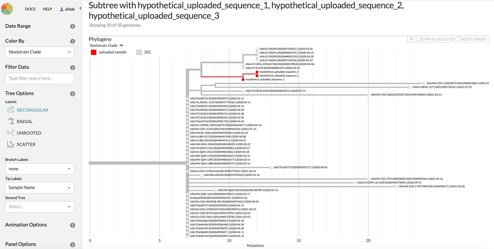

# Tools and methods

_In this Chapter we describe various types of methods you may want to use in applied genomic epidemiological analysis, as well as different software tools for performing those analyses. Since this handbook is narrowly focused on applied genomic epidemiological analysis, this chapter focuses on easily-deployable and fast tools for performing comparative analysis of multiple genome sequences. We do not discuss bioinformatic approaches for generating consensus genomes from sequencing read data, nor will we elaborate deeply on methods and tools used primarily in academic settings for genomic epidemiological analysis. This chapter is most pertinent for readers who will be performing genomic epidemiological analysis themselves._

## Phylogenetic placements

Phylogenetic placements are named as such since they place your samples of interest onto a previously-inferred, fixed phylogenetic tree. To do this, placement methods summarize the sequences of interest according to the nucleotide changes they carry compared to a reference sequence representing the root of the tree. This tree contains information about which mutations occurred along different branches in the tree. The sequences of interest are then placed into the "optimal" position on the tree according to the mutations that the samples of interest have and how those mutations are summarized by the tree. The optimal placement may be calculated differently when using different placement methods. While there are multiple methods for assessing the quality of the placement, the tools that genomic epidemiologists currently use most frequently determine the optimal placement by means of _parsimony_.

The most parsimonious placement of a sequence onto the tree is the one that requires the least number of _additional_ mutations in the sequence beyond the genetic changes summarized in the tree. Notably, there may be multiple placements of a sequence onto a tree that require the same number of additional changes, and thus have the same parsimony score. Under this framework, these placements represent equally likely placements on the tree. The number of equally likely placements thereby provides a measure of uncertainty in the placement. If there are many equally probable placements then we are uncertain which placement is the "true" placement. If the number of equally probable placements is low, then we can be relatively confident in the placement position.

There are currently two commonly-used tools for performing phylogenetic placements of SARS-CoV-2 genomes: [Nextclade](https://clades.nextstrain.org/) and [UShER](https://genome.ucsc.edu/cgi-bin/hgPhyloPlace). While both tools perform a phylogenetic placement, the phylogenies that Nextclade and UShER place samples of interest upon are different. This means that the way the output looks will be different, and what you can learn from one program may be more challenging to learn from the other. We recommend trying out and getting comfortable with both programs, as sometimes the UShER output is most informative, while other times the cohesive picture provided by Nextclade may be more helpful.

### UShER

UShER will take your sequences of interest and place them on a megatree built from _all_ SARS-CoV-2 sequences available from various public repositories (e.g. GISAID, NCBI GenBank, COG-UK data etc). In this way, UShER enables you to compare the genetic similarity of your samples to all other sequences available in the public repository of your selection.

UShER finds the _n_ (where you set n) most closely related samples to your own samples of interest, and places your sample onto a small “subtree” showing the relationship between your samples and the other genetically similar sequences. This capacity is particularly useful when you want to know what sequences your samples of interest are most closely related to. When your samples of interest are highly genetically similar they will frequently end up on the same subtree. However, if your samples are not genetically similar, UShER will provide multiple subtrees for each of the samples, showing your sample of interest’s placement among other publicly-available genome sequences that were genetically similar to your sample of interest.

When you run UShER, the program will return a table of metrics that summarize the placement (see Figure 7.1 for an example). These metrics will provide some information about the genome sequence that you placed (e.g. how long it was, how many insertions or deletions the genome had, how many N’s the sequence had etc.). The table also provides information about the placement, including how many mutations (SNVs) the sequence had that UShER used to place the sample, which sample is the most closely related to the sample of interest, the number of maximally parsimonious placements UShER found, and the parsimony score. Of these, the number of maximally parsimonious placements and the parsimony score are some of the best metrics for understanding your placement. As discussed in the introduction to phylogenetic placements, the number of maximally parsimonious placements provides a rough measure of certainty. If there are many parsimonious placements, then you can’t take any one of the subtrees as the “true placement”. The parsimony score will tell you how many additional mutations were in your sequence beyond the mutations observed in other sequences and summarized by the tree. The larger the parsimony score, the more diverged your sequence is from other sequences found in public repositories. When looking at the subtree, you’ll see that this parsimony score will be equal to the branch length observed between the tree and the sequence of interest. For example, in Figure 7.2 the red branch leading to `hypothetical_uploaded_sequence_1` is 3 nucleotides long, and that matches the parsimony score of 3 that you can see in Figure 7.1.

```{r usher-table, fig.cap='A screenshot from UShER showing the first entry in the UShER summary table for the hypothetical uploaded sequences that UShER provides. When you are on the website, you can hover over each of the column headers to learn more about them. You can see that metrics are given, and the cells are coloured according to a quality assessment.', out.width='80%', fig.asp=.75, fig.align='center', echo=FALSE}
knitr::include_graphics("figures/07-usher-table.png")
```

Note that while the table view in UShER will provide the name of a sequence entry that was most closely related to your sample of interest, there could be _multiple_ sequences that have identical genome sequences to whichever sequence shows up in the table as the “Neighboring sample in the tree.” You can see an example of this in Figure 7.2. In the table view (Figure 7.1), you can see that the Neighboring sample in tree for `hypothetical_uploaded_sequence_1` is `USA/MN-QDX-1663/2020 | MW190437.1 | 2020-03-17`. However, when you look at the tree in Figure 7.2, you see that `USA/MN-QDX-1663/2020` is one sample among many that have identical genome sequences, and thus stack vertically in the tree. This means that `USA/MN-QDX-1663/2020` is as close of a neighbor to `hypothetical_uploaded_sequence_1` as any other of the sequences in the subtree that have identical genome sequences as `USA/MN-QDX-1663/2020`.

```{r usher-tree, fig.cap='The subtree for hypothetical_uploaded_sample_1 that is linked in the last column of the UShER summary table. You can see that two more of the uploaded hypothetical samples are most closely related to hypothetical_uploaded_sample_1, and so these show up on the subtree as well. You can also see that there are many different samples that have the identical genome sequence to USA/MN-QDX-1663/2020. All of the samples with identical genome sequences to USA/MN-QDX-1663/2020 are as similarly related to hypothetical_uploaded_sample_1 as USA/MN-QDX-1663/2020 is, so in this case you should exercise caution in your interpretation.', out.width='80%', fig.asp=.75, fig.align='center', echo=FALSE}

```

### Nextclade

Nextclade will take in your sequences and perform some quality assessment on the consensus genomes. You can then also place the sequences onto a background Nextstrain tree, either a globally-diverse phylogeny that is available by default within Nextclade, or some other previously-inferred Nextstrain tree that you supply. The Nextclade phylogenetic placement has the benefit of showing a fuller picture of viral evolutionary history leading up to where Nextclade places your sample of interest. Additionally, the Nextclade placement will place all of your samples of interest onto the same background tree, allowing you to see their placements together. However, Nextclade does not include any contextual data beyond the background tree, thus sequences near to your sample of interest in the placement _may not_ be the most genetically similar sequences to your sample of interest. This is a key difference in interpretation between the Nextclade placement and the UShER placement.


```{r nextclade-tree, fig.cap='A Nextclade phylogenetic placement of 14 hypothetical samples. In contrast to the UShER subtree that we saw above, you can see the placement of all of these samples onto a single background tree, even though some of these samples are highly divergent. This provides a nice overview of the diversity of your sequences. However, this placement won’t tell you which sequences are most closely related to your uploaded sequences.', out.width='80%', fig.asp=.75, fig.align='center', echo=FALSE}
knitr::include_graphics("figures/07-nextclade-tree.png")
```
