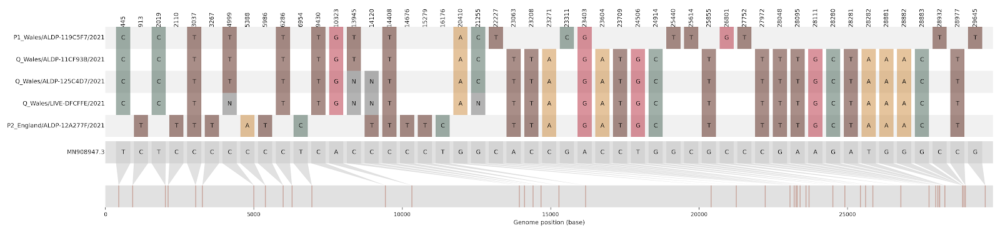

# Further concepts

_In this chapter we describe additional theoretical and practical concepts that you may encounter as you delve more deeply into using genomic epidemiology or reading the genomic epidemiology literature. These concepts likely won't crop up regularly in bread-and-butter genomic epidemiological applications, but are common enough that they do warrant some discussion and clarification. This Chapter is most pertinent to readers who already have some familiarity with genomic epidemiology, and are seeking to deepen their knowledge._

## Recombination

Typically when we talk about evolution, we consider the process by which an organism's genetic material is copied with random errors (mutations) and passed on to their progeny. Those progeny then have unequal chances of surviving and passing on that inherited variation, with additional mutations sprinkled in, to their offspring. Most probabilistic phylogenetic methods (like maximum likelihood or Bayesian approaches) aim to recapitulate this process by inferring whether sequences are more likely to share a mutation because the same mutation happened in other sequences, or because two or more sequences inherited the mutation from a common ancestor. The straightforward model of evolution where genetic material is inherited, mutated during replication, and then passed onto progeny is called clonal evolution, and it is how the vast majority of life evolves. However, recombination is another way to generate genetic variation, and it is frequent addition on top of the process of clonal evolution.

To use an analogy, human language is often "inherited" wholesale by offspring during childhood largely unchanged, which resembles clonal evolution. Occasionally, if a child has contact with other languages, they may borrow words from that other language and intersperse it in their speech; that borrowing is similar to how recombination works. In the strictest sense, recombination happens when a strand of genetic material is broken and joined onto another. In complex organisms like animals, recombination is nearly universal and obligatory - during the production of gametes (meiosis), each chromosome we inherited whole from our parents is recombined, i.e. a new chromosome is created by randomly "sampling" regions from one or the other parental chromosome. In non-eukaryotic microorganisms, recombination can integrate extraneous genetic material unrelated to anything in the host's genome in what is known as horizontal gene transfer, which is a type of non-homologous recombination (non-homologous because the host and incoming genetic material are not related). In RNA viruses specifically, nearly all recombination occurs between related sequences due to the template switching mechanism, whereby the RNA-dependent RNA polymerase dissociates from the original template it had been copying, together with the nascent RNA copy, and binds to a new template that is sufficiently complementary to the nascent copy to pair up and allow the continuation of RNA synthesis. The resulting RNA copy thus ends up being part original template and part new template.

Template switching likely takes place during all RNA virus infections, with the exception of negative sense single-stranded RNA viruses which effectively do not recombine. But in most cases, template switching will occur in a genetically homogenous infection in which the old template and the new template will be essentially the same genotype. Thus even with the process of template switching occurring, the resulting recombined sequences will not be distinguishable as such. This means that if you detect recombination in RNA viruses, likely the host had a genetically diverse infection, such as being co-infected with multiple different strains of a virus. Tools for detecting recombination are readily available but are not always well-explained or easy to interpret because they provide single numerical values like p-values, statistics, etc. Tests like these have a place in confirming recombination, but should not replace manual investigations of your sequence data for tell-tale signs of recombination.

What are these tell-tale signs? Firstly, you will likely observe an excessive number of repeat mutations; we refer to these as _homoplasies_. Walking through a toy example, imagine that at some point a virus has an A to G substitution at site 201 of its genome (A201G). If evolution proceeds only clonally, then we would expect that A201G mutation to occur and be passed on to the offspring. Notably, those offspring are descended from the same ancestor, and so they'll share other parts of the genome as well. This means that the progeny that inherit the A201G mutation will likely cluster together closely in a phylogenetic tree, and a single instance of the A201G mutation that is then inherited by the group of related viruses will explain the phylogenetic pattern. However, if you recombination is occurring, then a genetically diverse set of viruses could "pick up" the genetic material carrying the A201G mutation. On a tree, this would look as though many diverged groups of viruses all have that A201G mutation, even though the rest of their genomes are quite different. If the model strictly assumes clonal evolution, then the model's only explanation for this A201G pattern across all of these different groups of viruses is to assume that the A201G mutation happened many independent times. And thus, we have excessive repeat instances of A201G: a homoplasy. For another example of homoplasies, we can return to our language analogy from earlier. Many languages, even non-Romance languages, have Latin words. If we assumed that language only evolved clonally, then we would look at these Latin words across all of the different languages, and we would say that they had been invented multiple times independently (this would be the homoplasy). Of course the truth is that Latin words were not invented over and over again, but rather invented once in the Romance language family, and transferred by adoption to non-Romance languages.

Another feature of recombination is the spatial clustering of homoplasies along the sequence. This clustering occurs because recombination typically transfers stretches of genetic material, not just a single site. If the donor material is sufficiently diverged from its homologous counterpart in the recipient, then that stretch of genetic material will contain numerous mutations.

When unaccounted for, sufficiently recombined sequences used in conjunction with strictly clonal models of evolution lead to nonsensical inferences that can mislead the researcher. Judging how much recombination is too much, and when inferences are sabotaged beyond utility, is not easy and varies from situation to situation. Knowing the biology and ecology of the disease helps. If the pathogen is genetically homogenous, as is the case early in pandemics for example, or if co-infections are known to be rare, it can be argued that recombination is unlikely without even looking at the data. Other clues can also distinguish situations that produce similar signals to recombination from actual recombination. Recall that analysing recombinant sequences in phylogenetic models that are strictly clonal results in algorithms inferring that mutations transferred via recombination are recurring independently (homoplasies). While the recurrence of any given mutation (particularly in larger genomes) seems unlikely, the reality is that so many viral and bacterial progeny are produced during an infection, almost every possible mutation will occur. Thus in the presence of strong selective pressures to solve similar problems, recurrent changes are entirely expected. One of the best examples of this is E627K replacement in the PB2 protein of avian influenza A viruses jumping into humans. Virtually all human cases have this particular mutation, and with sufficient sampling of the virus in birds, it can be shown that this mutation occurs de novo in every single new jump into humans. Only recently was it shown that a specific interaction of the PB2 protein with ANP32A, a host protein that is sufficiently different between birds and humans, is at the root of this extremely strong selective pressure. In contrast, it is uncommon for synonymous mutations to be under similar selective pressures, and thus synonymous mutations are unlikely to recur and are a more believable marker of recombination.

One of the most thorough, unambiguous, and elegant demonstrations of recombination was performed by [Jackson et al](https://virological.org/t/recombinant-sars-cov-2-genomes-involving-lineage-b-1-1-7-in-the-uk/658) during the SARS-CoV-2 pandemic. Due to a comprehensive and long-running genomic surveillance programme in the UK, it had been possible to identify SARS-CoV-2 genomes assigned to lineage B.1.1.7 (alpha in WHO VOC nomenclature) but which didn't have all the mutations/SNPs that B.1.1.7 should have. A closer examination of such genomes revealed that regions missing B.1.1.7 mutations had mutations typical of other lineages, strongly suggestive of recombination. Furthermore, at least four distinct types of recombinant genomes were found, each with multiple sampled genomes sequenced by different groups. This is an extremely useful finding since it suggests that this signal of recombination did not originate from sample contamination or sequencing error. Another important aspect demonstrated by the researchers in this study was that putative parental lineages co-circulated at the same time in similar geographic locations.

```{r recombination, fig.cap='This condensed alignment shows mutations (compared to reference) of closest genomes to putative recombinant parents (first and fifth genomes) and putative recombinants (second, third, and fourth genomes) compared to the reference (sixth genome in grey). Positions 445-21255 contain SNPs typical of lineage B.1.1.7 while everything downstream are SNPs typical of B.1.1.7. One quick test for repeat mutations in such data is the presence of G4 sites which are pairs of alignment columns that only contain two alleles each but have all four possible haplotypes (sequence of SNPs/mutations along the genome) between them. For example, sites 21255 (containing either C or G) and 23063 (containing either A or T) spanning the recombination breakpoint contain all four possible haplotypes: GA (reference), CA (B.1.177), GT (B.1.1.7), and CT (recombinant). The logic of this simple test is that one of the mutations occurred earlier, giving rise to lineages X and Y, while later mutations at another site can only occur in one or the other background. Let's assume a second mutation occurred in lineage X. The presence of this newer mutation in lineage Y would indicate that either lineage Y acquired the same mutation independently or recombination transferred it from lineage X to Y.', out.width='80%', fig.asp=.75, fig.align='center', echo=FALSE}

```

## A deeper dive into molecular clocks

### Strict versus relaxed

In Chapter 3 we discussed molecular clocks, and how you could estimate the evolutionary rate by fitting a linear regression line through a root-to-tip plot. This type of clock is referred to as a **strict clock**. It is considered a strict clock because it fits the same evolutionary rate to all branches in the tree.

The idea that all branches in the tree evolve at the same rate is a simplifying assumption that lowers the parameterization of the analysis and generally makes computational analyses run faster. Strict clocks often work well, but there may be times when you want to capture evolutionary rate heterogeneity across the tree. To do so, you need to estimate branch-specfic evolutionary rates, and we can do this using **relaxed clocks**. One common method for estimating a relaxed molecular clock is using BEAST or BEAST2. While there are multiple ways to specify the relaxed clock parameterization, most commonly we consider the rate heterogeneity to be log-normally distributed and uncorrelated.

What does this mean? Firstly, branch-specific evolutionary rates are drawn from a log-normal distribution, which is a probability distribution that looks like a normal distribution in log-space. The draws are considered uncorrelated because each branch gets an independent draw regardless of where the branches are located in the tree, as opposed to forcing parent-offspring branches to have some correlation in their rates. During analysis, the parameters of the log-normal distribution, the mean and standard deviation, that best fit the sequence data at hand are estimated. While you can look at the branch specific rates, the mean rate across the entire tree is computed by summing all the mutations that must have happened across the tree (computed as the evolutionary rate for each branch multiplied by the length of that branch) and dividing that sum by the sum of all branch lengths in the tree.

Why might you want to use a relaxed clock? Firstly, using a relaxed clock prevents branches with more or fewer mutations than the average from having an undue influence over the molecular clock rate across the entire tree. Essentially, it prevents the average evolutionary rate from being unduly influenced by outliers. Secondly, sometimes branch-specific rate variation is one of the specific quantities that you would like to measure. For example, when investigating cases of sexual transmission of Ebola virus disease from survivors, a common indicator that such transmission has occurred is that the recipient viral infection looks genetically quite similar to the strain that the infector was infected with, even if many months have passed. On a tree estimated under a relaxed clock, this relative lack of genetic divergence given the amount of time that has elapsed between the infector's infection and the infectee's infection will show up as a much slower branch-specific evolutionary rate. For examples, see [Mbala-Kingebeni et al's (2021)](https://www.nejm.org/doi/full/10.1056/NEJMoa2024670) investigation of an Ebola virus disease relapse infection, or [Rambaut, McCrone, and Baele's (2019) tutorial](https://beast.community/ebov_local_clocks.html) on using relaxed clocks in BEAST to estimate Ebola virus disease rate heterogeneity.

### Reiterating caveats

Importantly, the molecular clock/evolutionary rate should never be taken as a proxy for natural selection or its strength. For one, the evolutionary rate largely reflects the accumulation of neutral variation. Adaptive mutations are also difficult to acquire by chance and frequently involve single amino acid changes which will not have a notable impact on the overall evolutionary rate. Another important aspect to keep in mind is the sampling scheme. When sampling particularly closely related infections, and especially when sequencing variants circulating in a single individual, an accelerated evolutionary rate is observed. This is primarily driven by intensive sampling capturing mildly deleterious variation that would otherwise be purged from the population which inflates estimated evolutionary rates.
